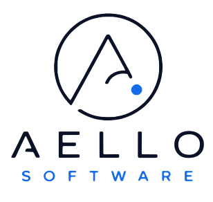

  <a href="https://aellosoftware.com">
    <picture>
      <source media="(prefers-color-scheme: dark)" srcset="./aello-logo-stacked-on-dark.svg">
      <source media="(prefers-color-scheme: light)" srcset="./aello-logo-stacked-on-light.svg">
      
    </picture>
  </a>

# Aello Software

Independent software company building focused SaaS products and open-source tools.

Aello creates practical software with calm interfaces, clear documentation, and dependable operations. Products are developed independently, published deliberately, and supported under one long-lived company identity.

## What we build

- Focused software that solves a specific problem well
- Developer tools and open-source infrastructure
- Reliable SaaS products with clear ownership and support

Public projects will appear here only after they pass Aello’s release-readiness review.

## Working with our projects

Each repository documents its own setup, support, contribution, security, and licensing terms. Please use the repository’s issue and pull-request templates when participating.

## Contact

- Website: [aellosoftware.com](https://aellosoftware.com)
- General: [hello@aellosoftware.com](mailto:hello@aellosoftware.com)
- Support: [support@aellosoftware.com](mailto:support@aellosoftware.com)
- Security: [security@aellosoftware.com](mailto:security@aellosoftware.com)

For sensitive security reports, do not open a public issue. Follow the repository’s security policy or contact the security address above.
